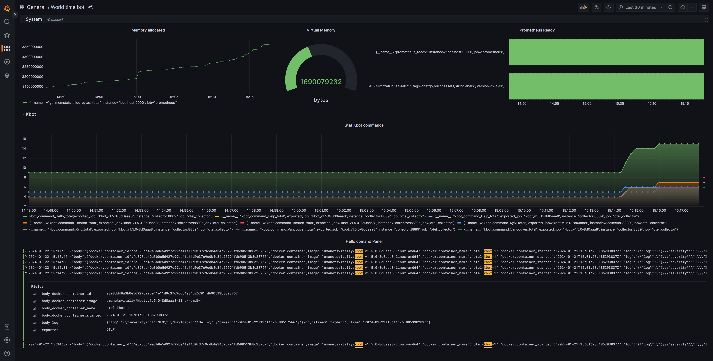

# Стек розгорнуто та налаштовано у локальному  dev-середовищі для демо проєкту за допомогою docker-compose

## Середовище розгортання
- VDS з [Ubuntu 22.04.3](https://ubuntu.com/) LTS (GNU/Linux 5.15.0-91-generic x86_64) та доменним ім'ям http://smart-home.dp.ua/
- [Телеграм бот](https://t.me/umanetsvitalii_bot) 🌍 time_bot
- [Docker Compose](https://docs.docker.com/compose/)

## Підготовка коду, інструменталізація коду бота та налаштування інтерфейсу Grafana

Весь процес налаштування та інструменталізації кода телеграм бота описаний в лекційному матеріалі [за цим посиланням](https://github.com/vit-um/DevOps/wiki/%D0%9C%D0%BE%D0%BD%D1%96%D1%82%D0%BE%D1%80%D0%B8%D0%BD%D0%B3#coding-session-k8s--otel)

## Процес розгортання

1. Клонуємо цей репозиторій з необхідними компонентами 
```sh
git clone -b opentelemetry https://github.com/vit-um/kbot
cd kbot
```
2. Готуємо змінну середовища з токеном: 
```sh
sudo -s
export TELE_TOKEN={token}
env
```

3. Розгортаємо заздалегідь налаштовані компоненти та описані в `docker-compose.yaml`:
```sh
git pull
docker-compose -f otel/docker-compose.yaml up
```

4. Налаштування інтерфейсу системи моніторингу

 
